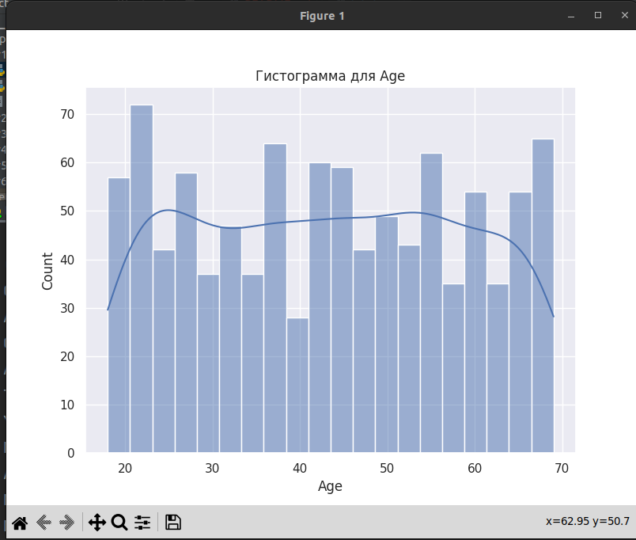
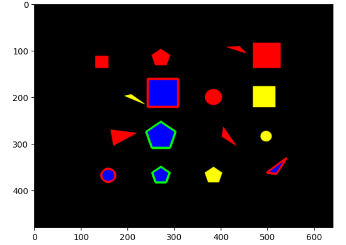
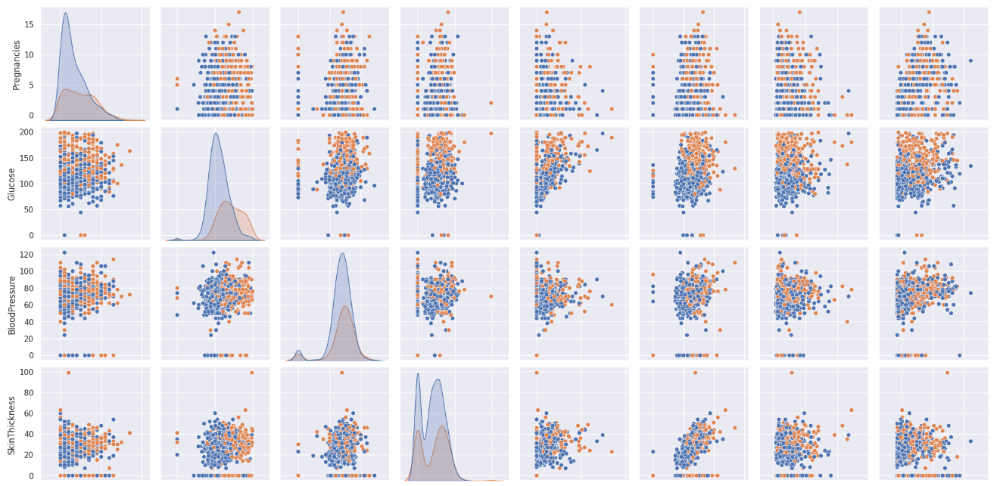
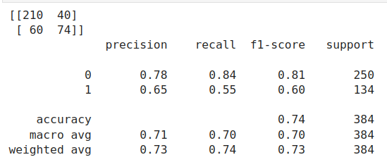
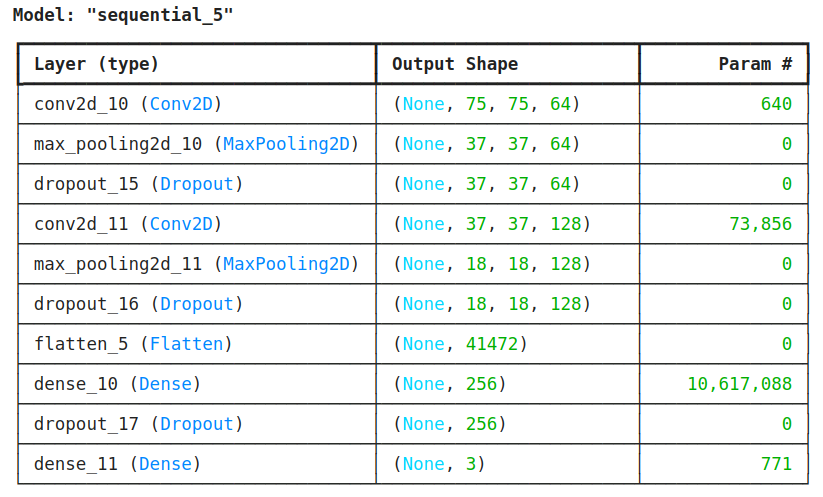
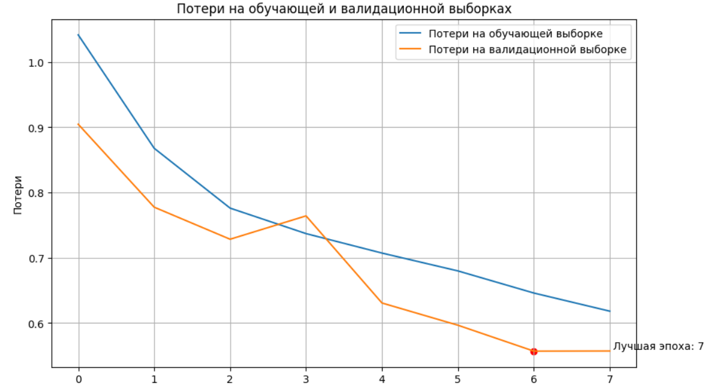
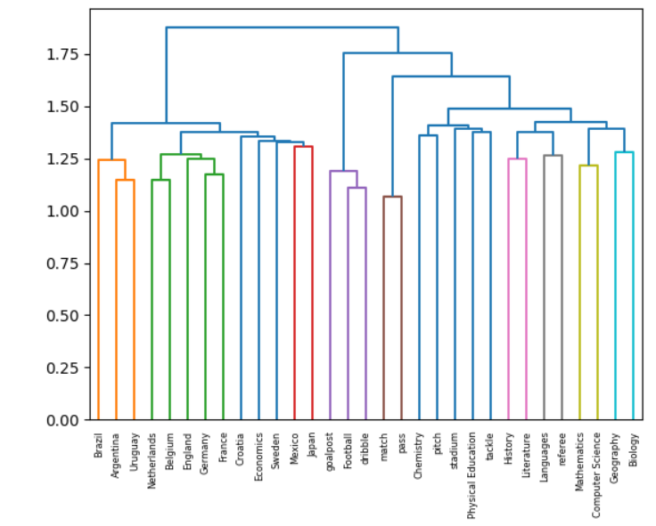
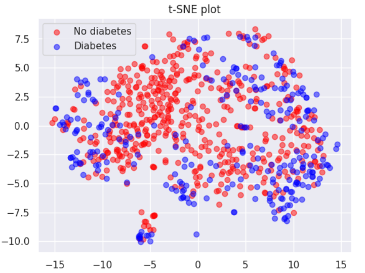

# Нейронные сети
ОИРС 8 семестр

<h1>ЛР1 - изучение основ pandas</h1>

<h1>ЛР2 - изучение основ cv2</h1>

<h1>ЛР3 - логистическая регрессия, метод опорных коэффициентов, </h1>

<h1>ЛР4 - сверточные сети для кластеризации</h1>

<h1>ЛР5 - TF-IDF, лемматизация, стемминг, иерархической кластеризации, K-means, DBSCAN, метод локтя</h1>

<h1>ЛР6 - t-SNE</h1>

